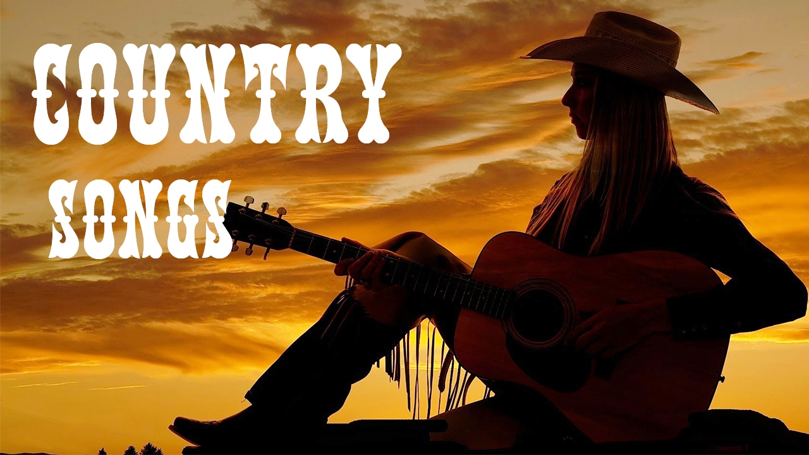

```{r Packages, message=FALSE, warning=FALSE}
packages.used=c("tidyverse","tidytext", "tm", 
                "RColorBrewer", "wordcloud", "reshape2", 
                "syuzhet", "sentimentr", "stringr", "beeswarm")
# check packages that need to be installed.
packages.needed=setdiff(packages.used, 
                        intersect(installed.packages()[,1], 
                                  packages.used))
# install additional packages
if(length(packages.needed)>0){
  install.packages(packages.needed, dependencies = TRUE)
}
# Load the required packages and data
library(tidyverse)
library(tidytext)
library(tm)
library(RColorBrewer)
library(wordcloud)
library(reshape2)
library(syuzhet)
library(sentimentr)
library(stringr)
library(beeswarm)
load("../output/processed_lyrics.RData")
```

[Reference: GoogleImage-Country Songs]

# _Introduction_ 
#### Country music is one of the most famous genres of music in this world since the 20th century and it is originated in the South Unite States from the 1920s. As I was a little child, I always heard the melodies such as  *Take Me Home, Country Roads* which is made by John Denver, a musician famous in my mother's years. However, nowadays, when I grow up, it seems like country music is not so famous like before, people aroung me often talk about pop, rock or rap and nearly no one would like to share their experience in country music. How did this change happen? 
#### In my opinion, a good song is always based on two things: melodies and lyrics. If the melodies can be said as the body of a song, then the lyrics will be the soul. So, in this project, I will use the lyrics of the country music to analyze whether there is a difference in lyrics between the 20th century and the 21st century.
```{r choose the genre topic, message=FALSE}
#Delete the useless rows and separate the time by 2000 
lyrics_fil <- dt_lyrics %>% 
  filter(genre!='Other' & genre!="Not Available") %>% 
  filter(year > 1900) %>% 
  mutate(time=ifelse(year<2000, 
                     "Before 2000", 
                     "After 2000"
                     )
         )
# Choose the interested genre 
lyrics_gerne_chs <- lyrics_fil %>% 
  filter(genre=="Country") 
```
# _Question 1: Did the Main Words change when in 21st Century?_

#### The stemmed words in lyrics always show the main idea of the song. To answer this question, I load the processed data which in the output file, delete the useless song(year not right) and separate the time to the two periods: "Before 2000" and "After 2000". Since the number of songs of different in the dataset, I compare the word appearance frequency in two time periods.
```{r get the word freq, message=FALSE, warning=FALSE}
# seprate by 2000
genre_chs <- lyrics_gerne_chs %>%
  select(year, genre, stemmedwords, time) %>% 
  unnest_tokens(word, stemmedwords) %>%
  group_by(time, word) %>% 
  count() %>% 
  arrange(desc(n)) %>% 
  transmute(num_time=n) %>% 
  ungroup()
total_num <- genre_chs %>% 
  group_by(time) %>% 
  summarise(num=sum(num_time))

# get the word frequency in different time period
genre_chs_freq <- genre_chs %>%
  left_join(total_num, by="time") %>% 
  mutate(word_freq=num_time/num*100) %>% 
  select(time, word, word_freq, num_time)
```
## _Main Words Comparision_

#### In the WordCloud Comparision plot, we can see the word "love" is much larger than the others, which means in both periods, the word "love" is the favorite word by country musicians. This is a reasonable result for me because, based on the information that my mother showed to me, John Denver's songs always show how he loves the world such as the home, Rocky Mountains, etc. 
#### The word frequency comparison plot shows the same result. The surprising thing is: the top 5 words are the same in this two time period and the rest words are nearly the same. This is a piece of strong evidence that could show: even the world in the 21st century, the musicians' favor of using the word has not changed based on our data of songs.  
```{r Words plots, message=FALSE, warning=FALSE, fig.dim=c(6, 4.5), fig.align='center'}
# wordcloud
genre_chs_freq %>%
  acast(word ~ time, value.var = "word_freq", fill=0) %>%
  comparison.cloud(max.words = 100,
                   scale=c(5,0.5),
                   colors = c("red", "blue"),
                   title.colors=c("red","blue"),
                   title.bg.colors = "gray",
                   random.order = F,
                   match.colors = F
                   )
```
```{r ggplot of word freq, warning=FALSE, message=FALSE, fig.align='center'}
# plot of word frequency in different time period
genre_chs_freq %>% 
  group_by(time) %>% 
  top_n(10) %>%
  ungroup() %>% 
  mutate(word=reorder(word, word_freq), 
         time=factor(time, levels=c("Before 2000", "After 2000"))) %>% 
  ggplot(aes(word, word_freq, fill=time))+
  geom_col(show.legend = F)+
  facet_wrap(~time, scales = "free_y")+
  coord_flip()+
  labs(x="Word",
      y="Frequency(%)", 
      title="Comparision of Word Frequency in Different Time Period")+
  theme_light()
```

# _Question 2: Did the sentiments of songs change?_


[Reference: GoogleImage-Sentiments]

#### Although there is not a change of the main word used in lyrics, we still cannot say lyrics are not changes. Sometimes the sentiments of a song are not decided by the main word in lyrics, as a result, a sentiments analysis is necessary. In this sentimental analysis, eight sentiments will be considered and the sentiments of a song are determined by the most sentiments that appeared in this song. The sentiment data is in the output file.
```{r sentmental ANA preparing, eval=FALSE, message=FALSE, warning=FALSE, evl=FALSE, include=FALSE}
#  This chunk is used for data processing for sentimental part. The output data is     already saved in output file. 
#  DO NOT RUN!

lyric.list=NULL
for(i in 1:nrow(lyrics_gerne_chs)){
  sentences=syuzhet::get_sentences(lyrics_gerne_chs$stemmedwords[i])
  if(length(sentences)>0){
    emotions=matrix(emotion(sentences)$emotion, 
                    nrow=length(sentences), 
                    byrow=T)
    colnames(emotions)=emotion(sentences[1])$emotion_type
    emotions=data.frame(emotions)
    emotions=select(emotions,
                   anticipation,
                   joy, 
                   surprise, 
                   trust, 
                   anger, 
                   disgust, 
                   fear, 
                   sadness)

    lyric.list=rbind(lyric.list, 
                        cbind(lyrics_gerne_chs[i,-ncol(lyrics_gerne_chs)],
                              song_lyr=as.character(sentences),
                              emotions
                              )
    )
  }
}
lyric.list <- lyric.list %>% 
  inner_join(lyrics_gerne_chs)
write.csv(lyric.list, file="../output/lyric_emotion.csv")
```

```{r, message=FALSE, warning=FALSE}
#  load the processed emotion data in the output file
lyric_emo <- read.csv("../output/lyric_emotion.csv")

lyric_emo$typemotion <- apply(select(lyric_emo, 
                                    anticipation:sadness), 
                                 1, which.max
                               )
lyric_emo$typemotion.val <- apply(select(lyric_emo, 
                                    anticipation:sadness), 
                                 1, max
                               )
lyric_emo.Af <- lyric_emo %>% 
  filter(time=="After 2000") %>% 
  mutate(song=1:length(song))
lyric_emo.Bf <- lyric_emo %>% 
  filter(time=="Before 2000") %>% 
  mutate(song=1:length(song))

lyric_emo <- rbind(lyric_emo.Bf, lyric_emo.Af) %>% 
  select(time, song, typemotion, typemotion.val) %>% 
  mutate(typemotion=case_when(typemotion==1 ~ "anticipation", 
                              typemotion==2 ~ "joy", 
                              typemotion==3 ~ "surprise", 
                              typemotion==4 ~ "trust", 
                              typemotion==5 ~ "anger", 
                              typemotion==6 ~ "disgust", 
                              typemotion==7 ~ "fear", 
                              typemotion==8 ~ "sadness")
         ) %>% 
  filter(typemotion.val!=0)
```
## _The main sentiments of each song in two time period_
#### A beeswarm plot is a good way to present the sentiment of each song. In the plots below, each dot represents each song, emotions value could clearly show how strong of this main sentiment in a song.
#### Even if the number of songs in two periods is different, from both plots, we clearly read that the spread of each sentiment is nearly the same. As a result, the sentiments of country songs have not changed a lot.
```{r beeswarm plot, fig.dim=c(8, 5), fig.align="center"}
# beeswarm of Before 2000
  beeswarm(typemotion.val~typemotion, 
           data=lyric_emo %>% filter(time=="Before 2000"), 
           pch=16,
           col=alpha(brewer.pal(8, "Set1"), 1), 
           cex=0.9, 
           cex.axis=0.8, 
           cex.lab=1,
           xlab="Sentiments", 
           ylab="Emotion Values",
           main="The Main Emotion of Each Song Before 2000")

# beeswarm of After 2000
  beeswarm(typemotion.val~typemotion, 
           data=lyric_emo %>% filter(time=="After 2000"),
           pch=16,
           col=alpha(brewer.pal(8, "Set1"), 1), 
           cex=0.2, 
           cex.axis=0.8, 
           cex.lab=1,
           xlab="Sentiments", 
           ylab="Emotion Values",
           main="The Main Emotion of Each Song After 2000")
```

# _Question 3: Did the songs become more or less sentimental?_
#### The main sentiment of the song is not the only determinant that attracts people. Except for the sentimental words, there is a kind of word called the neutral word, and the ratio that neutral words in a song will make a person like this song or not. For example, you like a song because the joy words and the emotion values of joy are the same in whole sentimental words but the second song has a much more neutral word. Which one you will like more?
#### This part, I use the "nrc" package to match the sentiment of each stemmedword in each song, and then to see the sentimental and neutral words usage frequency in each period. 
```{r Sentmental or not, warning=FALSE, message=FALSE}
nrc_senti <- get_sentiments("nrc")

emotion_lyric <- genre_chs %>% 
  left_join(nrc_senti) %>% 
  mutate(sentiment=ifelse(is.na(sentiment), "neutral", "sentimental")) %>% 
  group_by(time) %>%
  distinct(word, sentiment) %>% 
  group_by(time, sentiment) %>% 
  count() %>% 
  ungroup() 

total_num_emo <- emotion_lyric %>% 
  group_by(time) %>% 
  summarise(num=sum(n))

emotion_lyric_freq <- emotion_lyric %>% 
  left_join(total_num_emo, by="time") %>% 
  mutate(senti_freq=n/num*100) %>% 
  select(time, sentiment, senti_freq)

```
## _Comparision of word sentiment frequency_
#### The graph below shows a comparison of the sentiment word appearance of two periods. It is clear to see that the ratio of sentimental words strict decreases in the 21st century which is around 20%. As a result, a decrease in the usage of sentimental words is a reason that makes the country songs not so famous in the 21st century.
```{r, message=FALSE, warning=FALSE, fig.align='center'}
emotion_lyric_freq %>% 
  mutate(sentiment=reorder(sentiment, senti_freq), 
         time=factor(time, levels=c("Before 2000", "After 2000"))) %>% 
  ggplot(aes(sentiment, senti_freq, fill=time))+
  geom_col(show.legend = F)+
  facet_wrap(~time)+
  labs(x="",
       y="Frequency(%)", 
       title="Comparision of Sentimental or Neutral in Different Time Period")+
  theme_light()

```

# _Conclusion_
#### In this project, the main topic is to analyze what makes the country songs not so famous as the 20th century based on the lyrics. In my three questions, the result shows that the main words and the main sentiments of songs have not a significant difference between the 20th and 21st centuries. The only thing changed is the ratio of sentiment words and neutral words, and this ratio shows a decent chance. However, whether a person like a song is not only determined by the lyric, melody is also a big part. We need also to consider the melody to explain why people's favor changes.


[Reference: GoogleImage-Country Songs]:(https://www.google.com/imgres?imgurl=https%3A%2F%2Fi.ytimg.com%2Fvi%2Foh3Rk7yT-zc%2Fmaxresdefault.jpg&imgrefurl=https%3A%2F%2Fwww.youtube.com%2Fwatch%3Fv%3Doh3Rk7yT-zc&docid=89f6oxN1V6pMqM&tbnid=rZ7k7IR1YX2teM%3A&vet=10ahUKEwjyt4_mjrTnAhXNlXIEHS29Df4QMwiAASgEMAQ..i&w=1280&h=720&bih=803&biw=1364&q=country%20songs&ved=0ahUKEwjyt4_mjrTnAhXNlXIEHS29Df4QMwiAASgEMAQ&iact=mrc&uact=8)
[Reference: GoogleImage-Sentiments]:(https://www.google.com/url?sa=i&source=images&cd=&ved=2ahUKEwj_qMidlrTnAhXNlHIEHYr9CRgQjRx6BAgBEAQ&url=https%3A%2F%2Ftowardsdatascience.com%2Fsentiment-analysis-on-nba-top-players-twitter-account-part3-sentiment-analysis-clustering-5e5dcd4d690f&psig=AOvVaw23LklTdKNl0L7FOmtX6D8s&ust=1580777757136339)